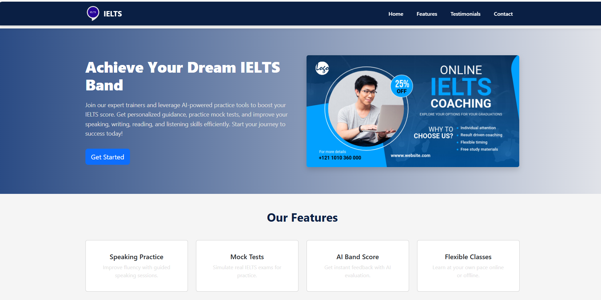

# IELTS Institute - React Home Page



## Overview
This is a **modern, responsive Home Page for a fictional IELTS Institute**, built using **React.js** and **React-Bootstrap**. The design focuses on **user experience and modern UI**, making it visually appealing and interactive.

---

## Features

- **Navbar:** Fixed top, navy blue background, white text, orange accent buttons.  
- **Hero Section:** Large banner, headline, subtext, call-to-action button.  
- **Features Section:** 4 feature cards (Speaking Practice, Mock Tests, AI Band Score, Flexible Classes) with navy blue cards and white text.  
- **Testimonials:** Carousel with student reviews, navy cards inside a white section, interactive hover effects.  
- **Footer:** Interactive, navy background, white text, orange social icons.

---

## Technologies Used

- **React.js**  
- **React-Bootstrap**  
- **Bootstrap 5**  
- **CSS (Custom styling)**  
- **React Icons**

---

## Setup Instructions

1. Clone the repository:

```bash
git clone <your-repo-link>
